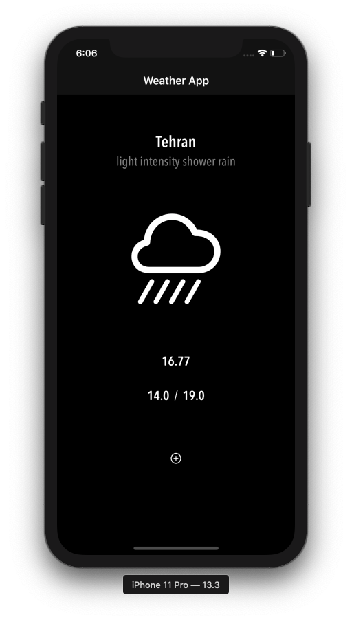

# Weather-App
Weather app for get current weather data with city name

Tools or concepts that I use in this projct :

URLSession

SwiftyJSON

Confirm to MVC

Dark mode support

TableView

API for get weather data : https://openweathermap.org

Thanks for desing : https://dribbble.com/shots/9723236-Mono-Weather-iOS

